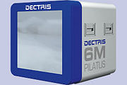

Pilatus
-------



Intoduction
```````````
The PILATUS detector (pixel apparatus for the SLS) is a novel type of a x-ray detector, which has been developed at the Paul Scherrer Institut (PSI) for the Swiss Light Source (SLS). PILATUS detectors are two-dimensional hybrid pixel array detectors, which operate in single-photon counting mode. A hybrid pixel that features single photon counting, comprises a preamplifier, a comparator and a counter. The preamplifier enforces the charge generated in the sensor by the incoming x-ray; the comparator produces a digital signal if the incoming charge exceeds a predefined threshold and thus, together with the counter, one obtains a complete digital storage and read-out of the number of detected x-rays per pixel without any read-out noise or dark current!

PILATUS detectors feature several advantages compared to current state-of-the-art CCD and imaging plate detectors. The main features include: no readout noise, superior signal-to-noise ratio, read-out time of 5 ms, a dynamic range of 20bit, high detective quantum efficiency and the possibility to suppress fluorescence by a energy threshold that is set individually for each pixel. A more complete comparison is given in Table 1. The short readout and fast framing time allow to take diffraction data in continuous mode without opening and closing the shutter for each frame (see Fig. 1). For a comparison on the response to x-rays of integrating and single photon counting detectors see Fig. 2.

Because of the specified properties, PILATUS detectors are superiour to state-of-the-art CCD and imaging plate detectors for various x-ray detection experiments. Major improvements can be expected for time-resolved experiments, for the study of weak diffraction phenomena (e.g. diffuse scattering), for accurate measurements of Bragg intensities, for resonant scattering experiments,...

Module configuration
````````````````````

Pilatus python module need at least the lima core module.

The minimum configuration file is *config.inc* :

.. code-block:: sh

  COMPILE_CORE=1
  COMPILE_SIMULATOR=0
  COMPILE_SPS_IMAGE=1
  COMPILE_ESPIA=0
  COMPILE_FRELON=0
  COMPILE_MAXIPIX=0
  COMPILE_PILATUS=1
  COMPILE_CBF_SAVING=0
  export COMPILE_CORE COMPILE_SPS_IMAGE COMPILE_SIMULATOR \
         COMPILE_ESPIA COMPILE_FRELON COMPILE_MAXIPIX COMPILE_PILATUS \
         COMPILE_CBF_SAVING


See :ref:`Compilation`


Installation
````````````

- After installing python modules on pilatus pc :ref:`installation`

- And probably Tango server :ref:`tango_installation`

- On Pilatus PC create **as root** a ramdisk of 8GB which will be used by Lima dserver as temporary buffer:

    * edit file /etc/fstab and add the following line: 
    
    .. code-block:: sh

      none                 /lima_data tmpfs    size=8g,mode=0777      0 0

    * make the directory: 

    .. code-block:: sh

      mkdir /lima_data

    * and finally mount the ramdisk: 

    .. code-block:: sh

      mount -a

Start the system
````````````````

- Log on the detector pc as *det* user start tvx/camserver:

  .. code-block:: sh

    cd p2_det
    ./runtvx

- when tvx has finished initializing camserver just type *quit* in tvx window

- Log on the detector pc as *an other user* or *det*

  .. code-block:: sh

    cd WHERE_YOU_HAVE_INSTALL_PILATUS_TANGO_SERVER
    TANGO_HOST=Host:Port python LimaCCD.py instance_name

If the cameserver window notice a connection, seams to work ;)